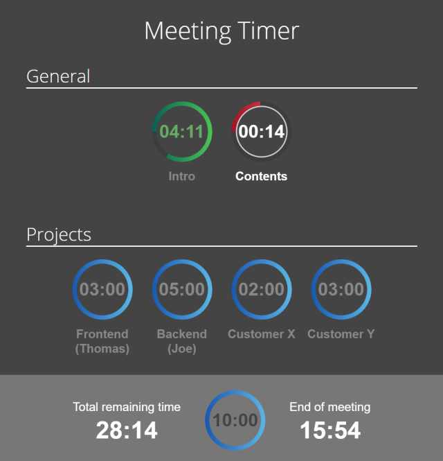

Meeting Timer
=============

Your meetings take too long? People don't focus on the important parts, but getting lost in the details?
Then Meeting Timer is the right thing for you!

Every topic has its own timer. Discussion and question time will be counted by the timer in the bottom panel.

Install
-------

This is a serverless HTML + JavaScript app. Simply open `index.htm` in your browser!
No internet connectivity is required.

Usage
-----

##### Prior to meeting

* Let everyone give a time estimate for their topic
* Modify `index.htm` accordingly *(this process could be improved, please contribute!)*
* Open `index.htm` in your browser, share your screen for everyone to see the timers

##### During the meeting

* Click a timer to start it. Any other timer will stop
* Start/Stop: Press `[SPACE]` to start/stop the selected timer
* Done: When a topic is done, hit `[D]` on the keyboard to mark it as done and start the next one
* Discussion: While timer is running, hit `[C]` if a question was asked and a discussion starts. Hit `[C]` again when the topic continues

##### Advanced usage

* Selection: You can navigate the white selection with `[LEFT]` and `[RIGHT]` arrows
* Reset: Type a number and hit `[ENTER]` to reset the selected timer to a certain value

Credits
-------

Code is based on [jquery-circle-progress](http://kottenator.github.io/jquery-circle-progress/)
